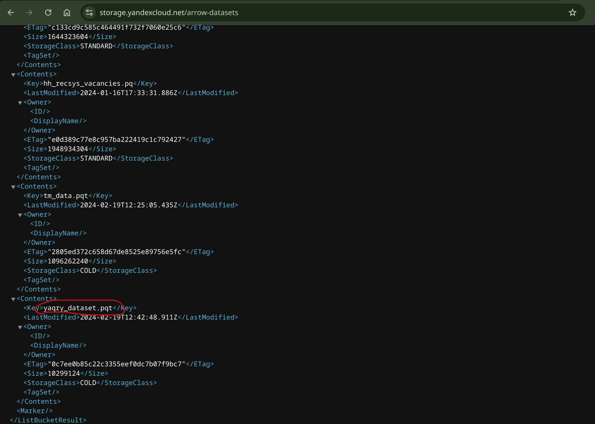
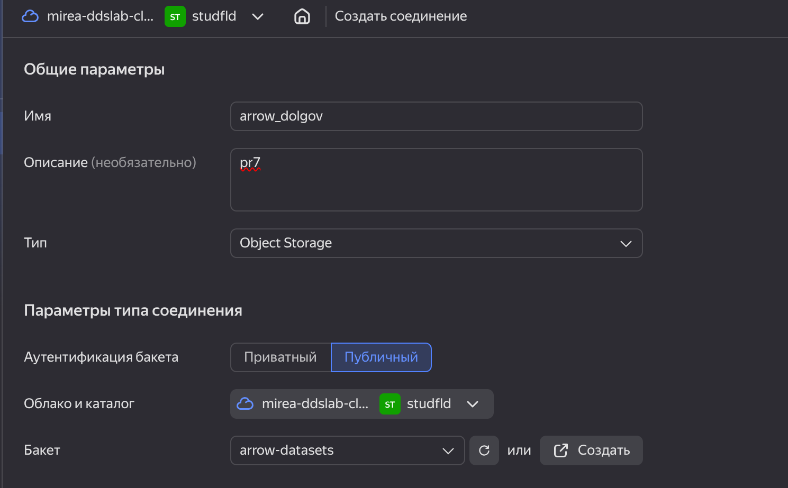
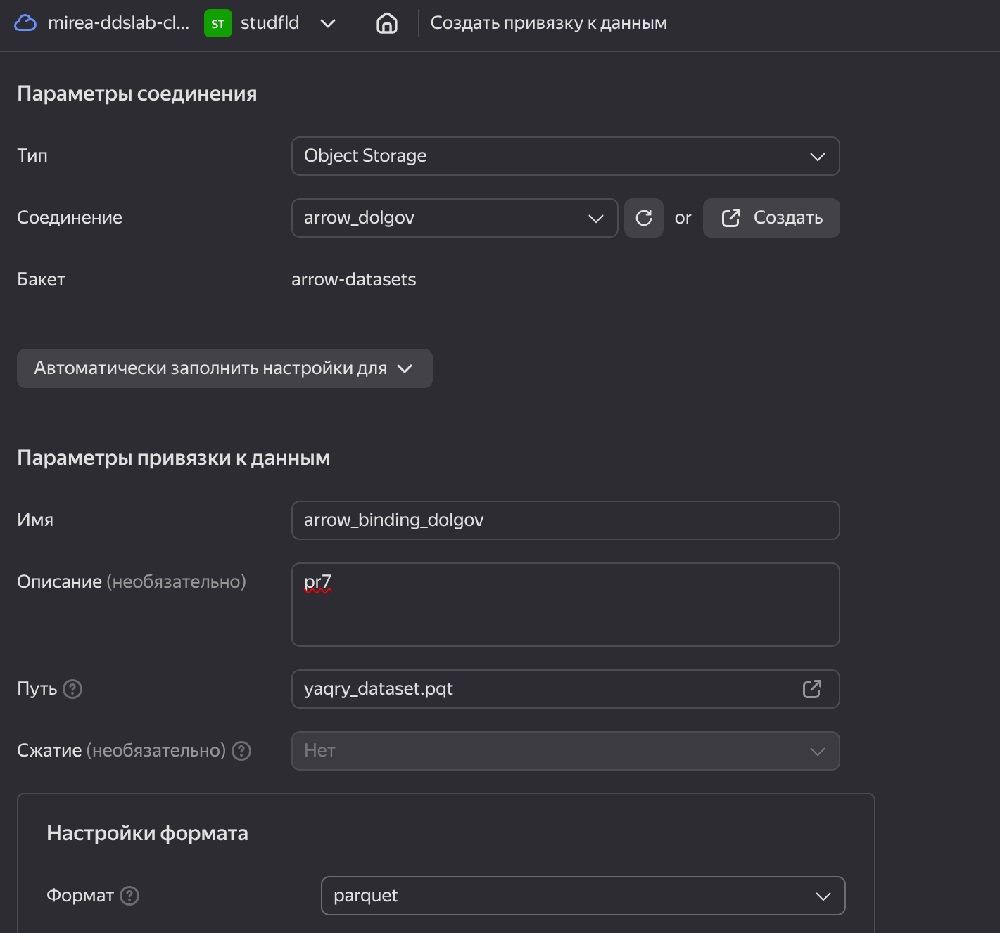
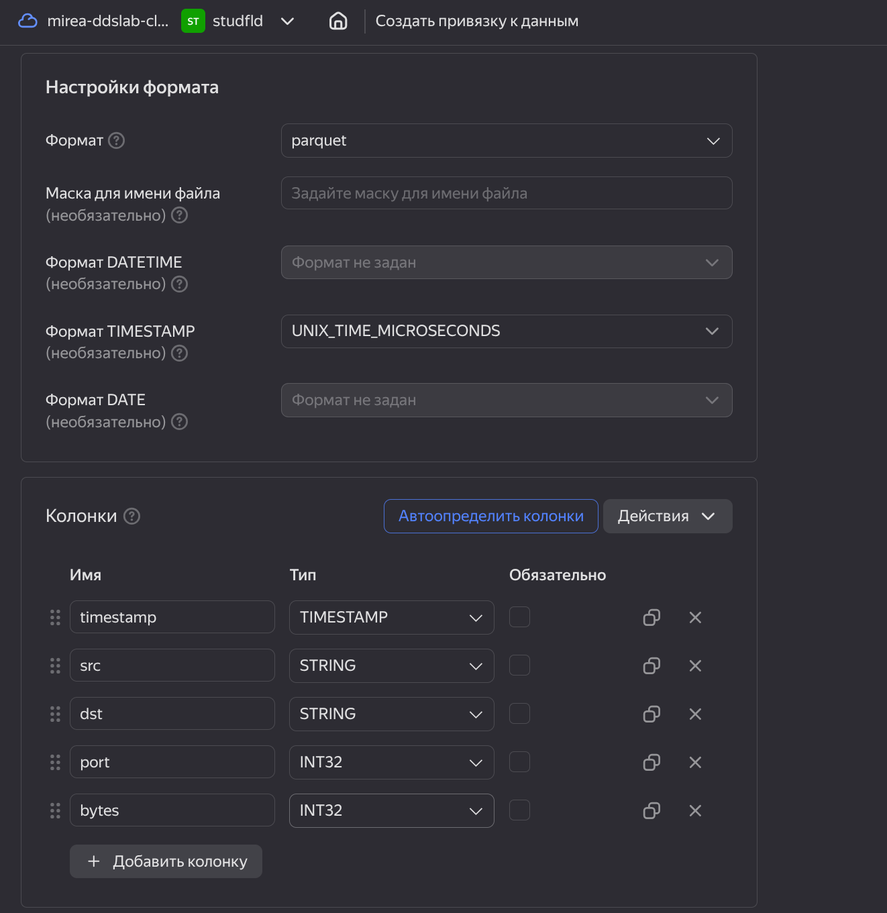
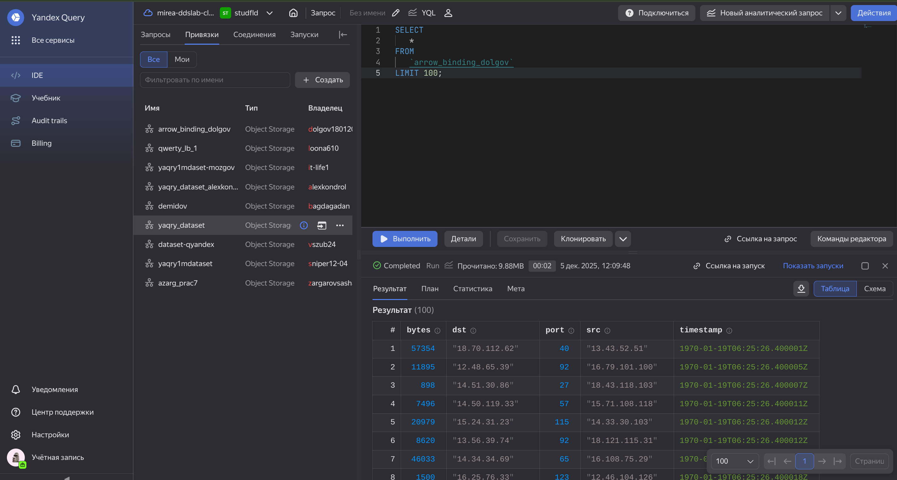
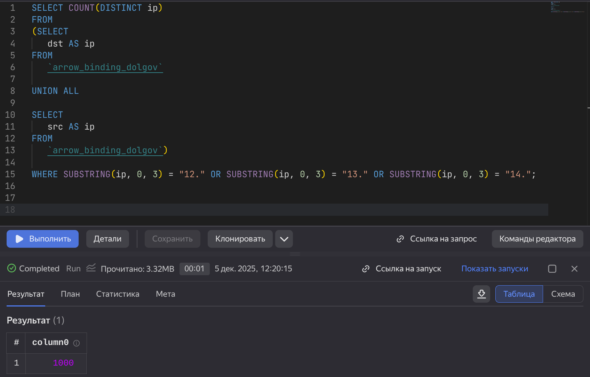
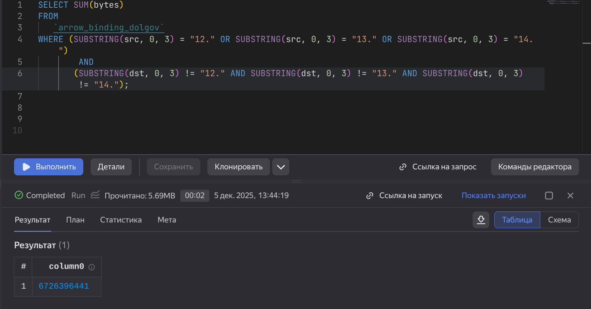
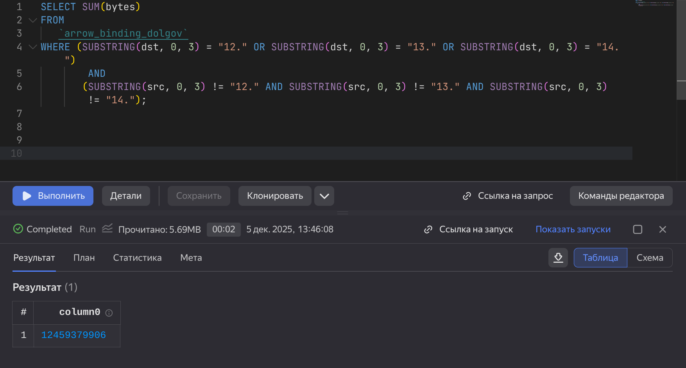

# Практическая работа 007
dolgov18012005@yandex.ru

## Цель работы

1.  Изучить возможности технологии Yandex Query для анализа
    структурированных наборов данных
2.  Получить навыки построения аналитического пайплайна для анализа
    данных с помощью сервисов Yandex Cloud
3.  Закрепить практические навыки использования SQL для анализа данных
    сетевой активности в сегментированной корпоративной сети

## Исходные данные

1.  Программное обеспечение Manjaro
2.  Rstudio Desktop
3.  Интерпретатор языка R 4.5.1

## Задание

Используя сервис Yandex Query настроить доступ к данным, хранящимся в
сервисе хранения данных Yandex Object Storage. При помощи
соответствующих SQL запросов ответить на вопросы

## Ход работы

1.  Проверить доступность данных в Yandex Object Storage  
    1.1. Проверить доступность данных (файл yaqry_dataset.pqt) в бакете
    arrow-datasets S3 хранилища Yandex Object Storage.

2.  Подключить бакет как источник данных для Yandex Query  
    2.1. Создать соединение для бакета в S3 хранилище (Заполнить поля с
    учетом допустимых символов, выбрать тип аутентификации – публичный.
    Ввести имя бакета в соответствующее поле и сохранить )  
    2.2. Создать и настроить привязку (Указать какой объект использовать
    в качестве источника данных).

3.  Анализ  
    3.1. Известно, что IP адреса внутренней сети начинаются с октетов,
    принадлежащих интервалу 12-14. Определить количество хостов
    внутренней сети, представленных в датасете.  
    3.2. Определить суммарный объем исходящего трафика.  
    3.3. Определить суммарный объем входящего трафика.

### Шаг 1

#### Проверим доступность данных

Перейдем по ссылке и посомтрим доступность данных

### Шаг 2

#### Создадим соединение для бакета в S3 хранилище

#### Создадим и настроим привязку данных

Опишем данные в колонках

Успешное подключение

### Шаг 3

#### Определим количество хостов внутренней сети, представленных в датасете.

Составим следующий запрос:

    SELECT COUNT(DISTINCT ip)
    FROM 
    (SELECT
       dst AS ip
    FROM
       `arrow_binding_dolgov`

    UNION ALL

    SELECT
       src AS ip
    FROM
       `arrow_binding_dolgov`)

    WHERE SUBSTRING(ip, 0, 3) = "12." OR SUBSTRING(ip, 0, 3) = "13." OR SUBSTRING(ip, 0, 3) = "14.";

1000 хостов во внутренней сети

#### Определить суммарный объем исходящего трафика.

Составим следующий запрос:

    SELECT SUM(bytes)
    FROM 
       `arrow_binding_dolgov`
    WHERE (SUBSTRING(src, 0, 3) = "12." OR SUBSTRING(src, 0, 3) = "13." OR SUBSTRING(src, 0, 3) = "14.")
            AND
           (SUBSTRING(dst, 0, 3) != "12." AND SUBSTRING(dst, 0, 3) != "13." AND SUBSTRING(dst, 0, 3) != "14.");

#### Определить суммарный объем входящего трафика.

Составим следующий запрос:

    SELECT SUM(bytes)
    FROM 
       `arrow_binding_dolgov`
    WHERE (SUBSTRING(dst, 0, 3) = "12." OR SUBSTRING(dst, 0, 3) = "13." OR SUBSTRING(dst, 0, 3) = "14.")
            AND
           (SUBSTRING(src, 0, 3) != "12." AND SUBSTRING(src, 0, 3) != "13." AND SUBSTRING(src, 0, 3) != "14.");

### Итог

Отчёт написан и оформлен
