# Практическая работа 008
dolgov18012005@yandex.ru

## Цель работы

1.  Изучить возможности технологии Yandex DataLens для визуального
    анализа структурированных наборов данных
2.  Получить навыки визуализации данных для последующего анализа с
    помощью сервисов Yandex Cloud
3.  Получить навыки создания решений мониторинга/SIEM на базе облачных
    продуктов и открытых программных решений
4.  Закрепить практические навыки использования SQL для анализа данных
    сетевой активности в сегментированной корпоративной сети

## Исходные данные

1.  Программное обеспечение Manjaro
2.  Rstudio Desktop
3.  Интерпретатор языка R 4.5.1

## Задание

Используя сервис Yandex DataLens настроить доступ к Yandex Query,
который Вы использовали в ходе ранее выполненных практических работ, и
визуально представить результаты анализа данных.

## Ход работы

1.  Настроить подключение к Yandex Query из DataLens  
    1.1. Перейти в соответствующий сервис – https://datalens.yandex.ru  
    1.2. Выбрать “Подключения” – “Создать новое подключение” 1.3.
    Выбрать в разделе “Файлы и сервисы” Yandex Query 1.4. Настроить и
    проверить подключение

2.  Создать из запроса YandexQuery датасет DataLens  

3.  Сделать нужные графики и диаграммы  
    3.1. Представить в виде круговой диаграммы соотношение внешнего и
    внутреннего сетевого трафика.  
    3.2. Представить в виде столбчатой диаграммы соотношение входящего и
    исходящего трафика из внутреннего сетевого сегмента  
    3.3. Построить график активности (линейная диаграмма) объема трафика
    во времени.

4.  Составить дашборд

### Шаг 1

#### Перейдем на сайт DataLens

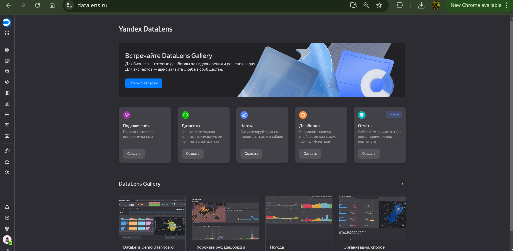

#### Выберем создать новое подключение

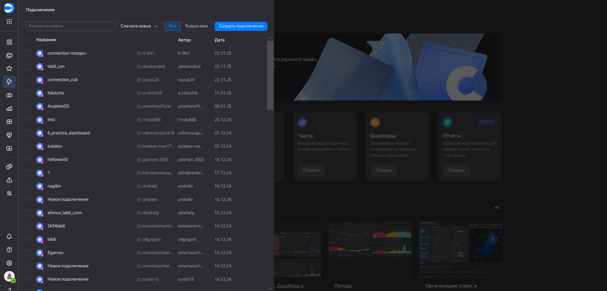

#### Выберем в разделе “Файлы и сервисы” Yandex Query

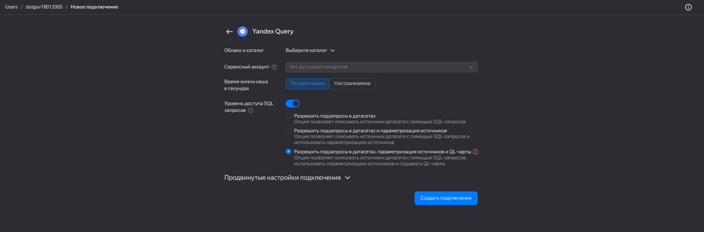

#### Настроим и проверим подключение

Настройка:

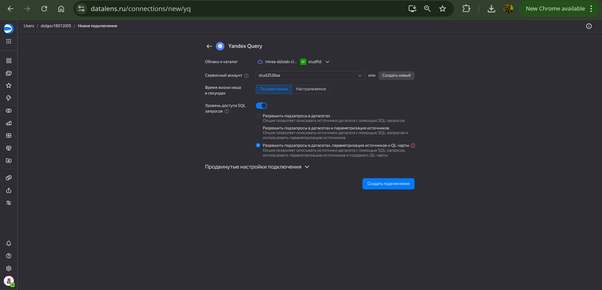

### Шаг 2

Перетащим ранее созданную таблицу

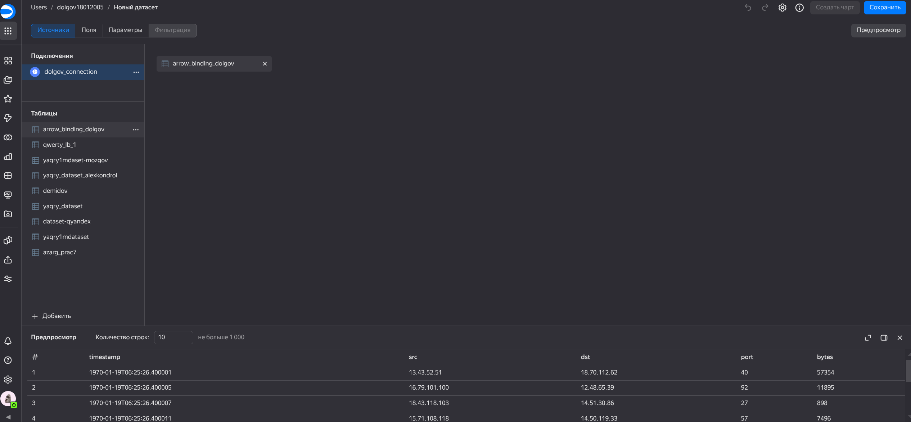

### Шаг 3

#### Создадим круговую диаграмму соотношения внешнего и внутреннего сетевого трафика

Выберем поле чарт и нажмем создать чарт

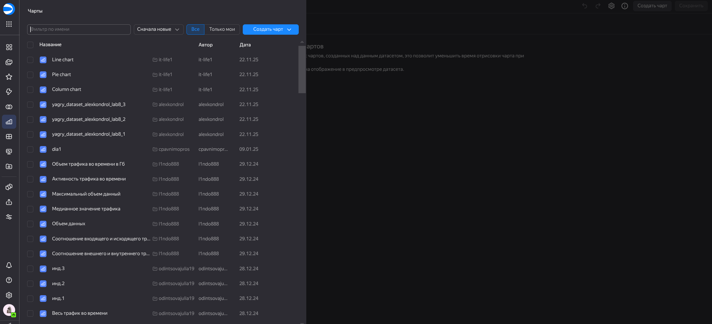

Для начала создадим дополнительное поле для классификации нашего трафика

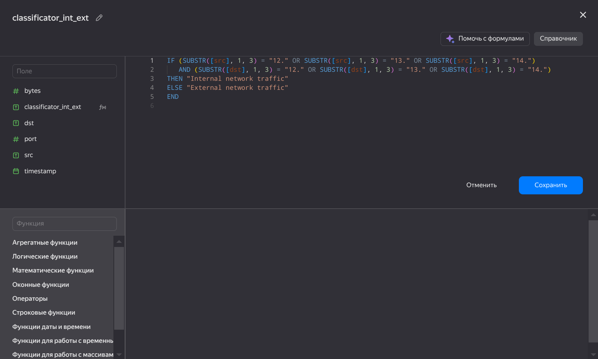

Добавим название чарта и укажем параметры цвета, показателя и подписи.

Итоговый чарт:

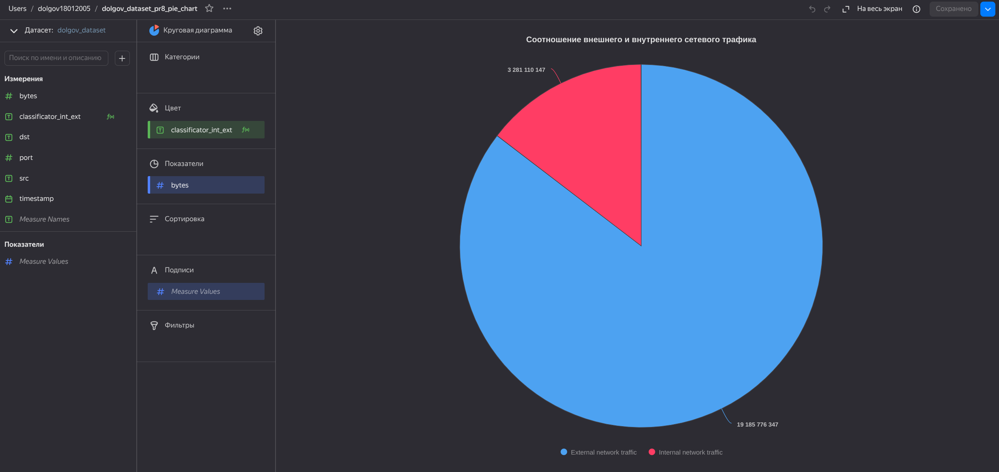

#### Создадим столбчатую диаграмму соотношения входящего и исходящего трафика из внутреннего сетевого сегмента

Снова создадим дополнительное поле, которое указывает входящий трафик
или исходящий

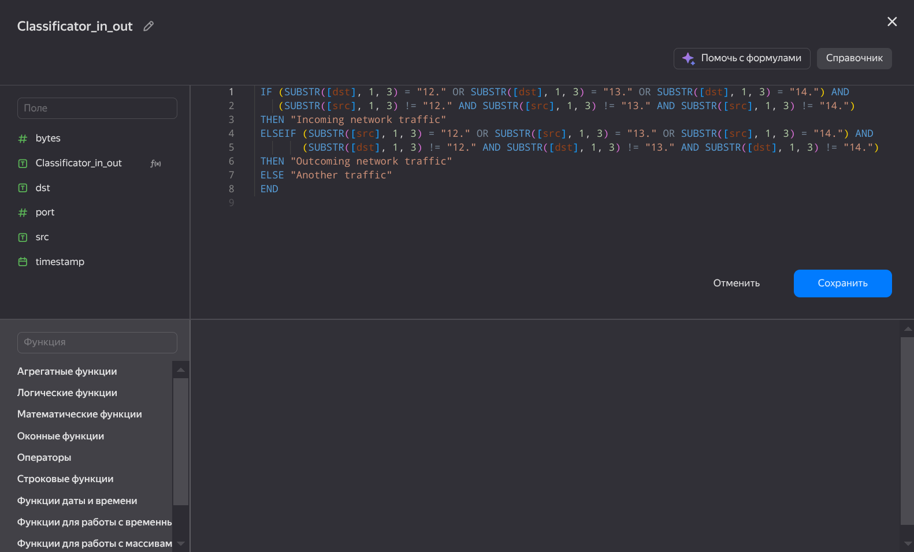

В качестве параметра x укажем наше поле, а за y возьмем sum(bytes).
Укажем в качестве фильтра только классы incoming и outcoming (уберем
other). Так же укажем параметр цвета, подписи, названия графика, а также
уберем легенду.

Итоговый чарт:

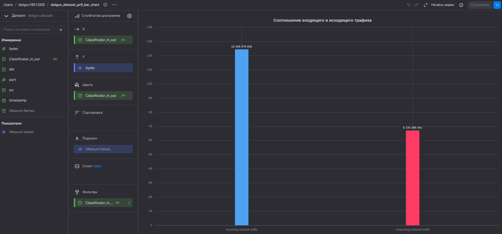

#### Построим график активности объема трафика во времени.

Так как изменение нашей временной метки происходит на уровне милисекунд,
то придется преобразовать поле времени. Также для корректного
отображения нобходимо преобразовать поле времени в бины. Используем
следующее преобразование времени (константы были подобраны
экпериментально)

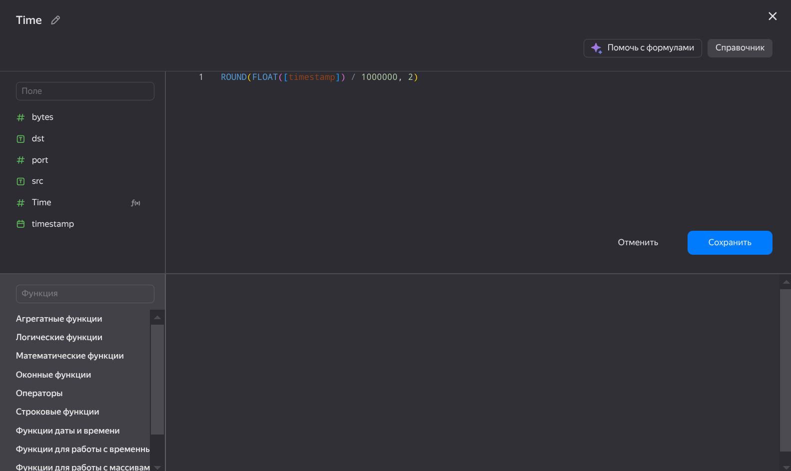

За ось x возьмем нашу новую переменную, отвечающую за время, а за y
возьмем sum(bytes). Укажем название чарта сверху.

Итоговый чарт:

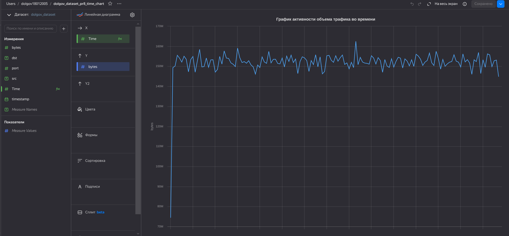

### Шаг 4

Составим дашборд из ранее составленных чартов

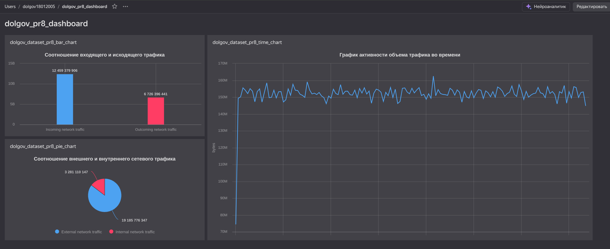

[Ссылка на тоговый дашборд](https://datalens.ru/7qtven3p5ibcs)

### Итог

Отчёт написан и оформлен
